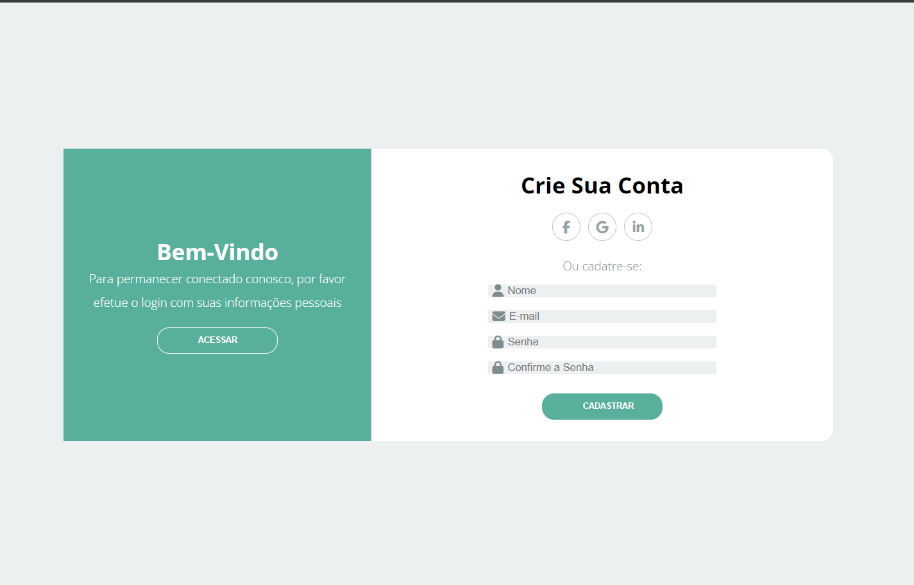
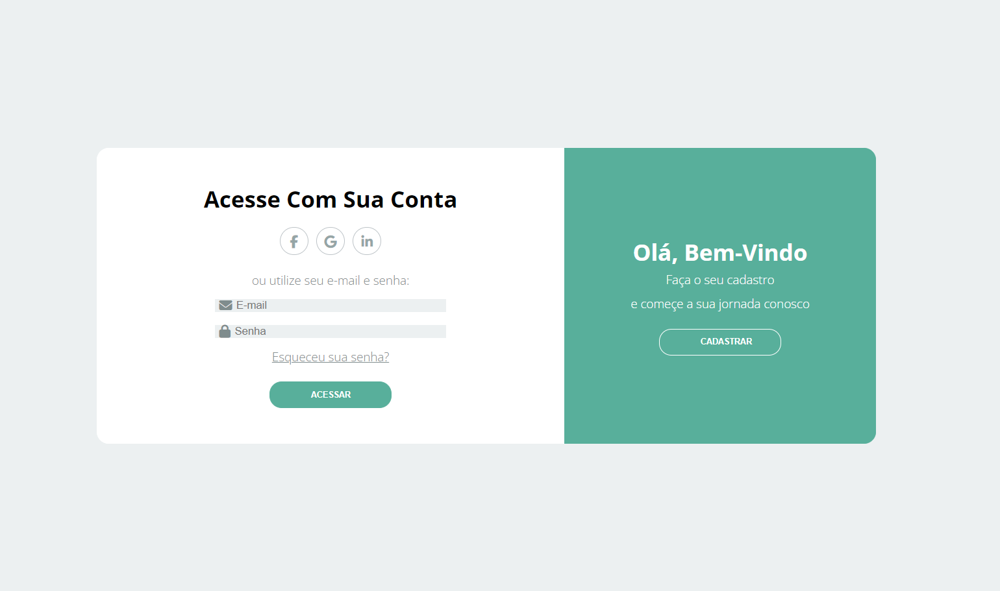

# Home Screen

## Descrição
Este projeto apresenta modelos de telas para um aplicativo de gerenciamento de tarefas. O objetivo é criar uma interface intuitiva e fácil de usar.

## Modelos das Telas
Aqui estão alguns dos modelos de telas incluídos no projeto:

- **Tela 1: Cadastro de Usuário**
  
  - Esta é a primeira tela que aparece para o usuário, onde ele pode se cadastrar informando nome, email, confirmando a senha e inserindo a senha. 
  - Há um botão para cadastrar, além de opções para se cadastrar via ícones do Google, Facebook e LinkedIn.

- **Tela 2: Acesso à Conta**
  
  - Esta tela é para usuários já cadastrados. Eles podem digitar o email e a senha para acessar a conta.

- **Tela 3: Bem-Vindo**
  .png)
  - Esta tela exibe uma mensagem de boas-vindas, mas precisa ser melhorada.

## Instalação
Para instalar e executar este projeto, siga os passos abaixo:

1. Clone o repositório:
   ```bash
   git clone https://github.com/viniciuscamacho230/Home-Screen.git
